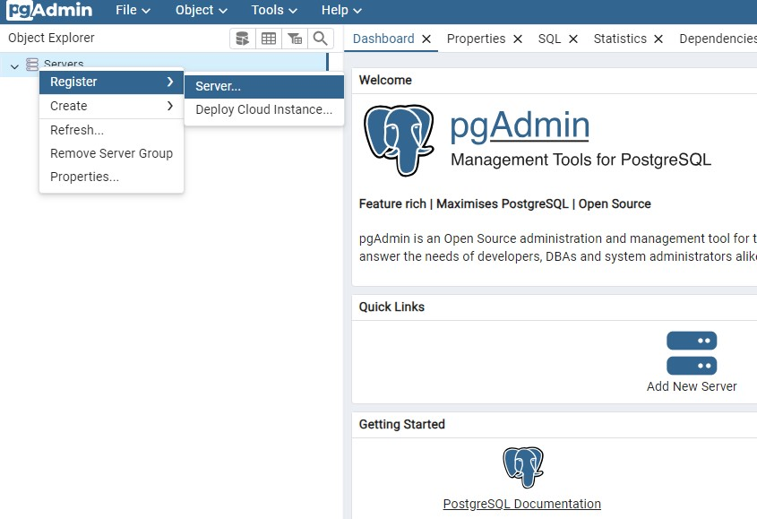
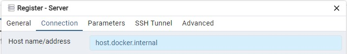
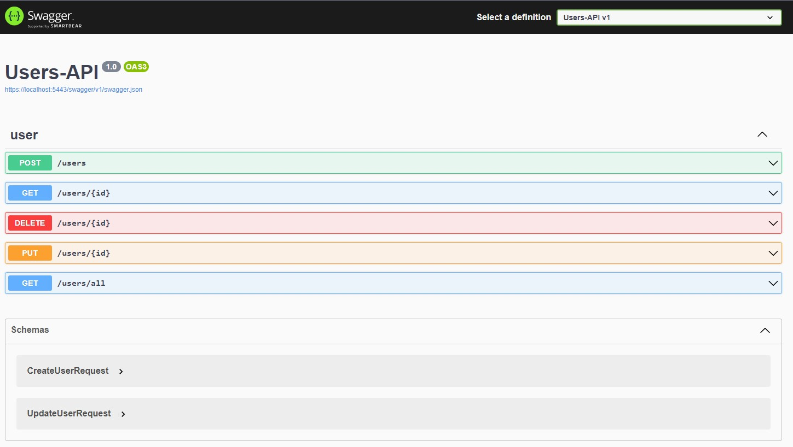
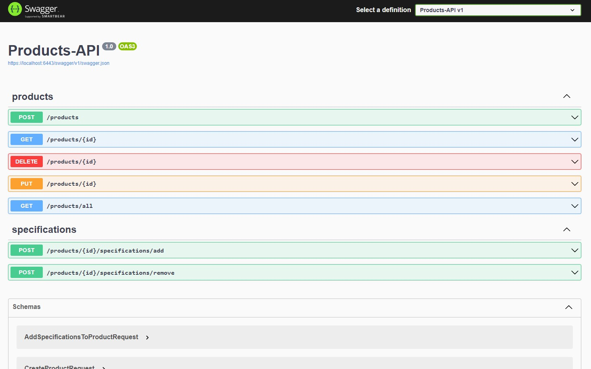
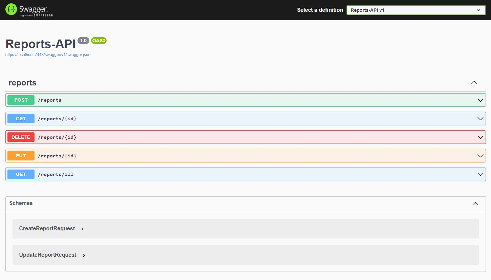

# YARP-Testing

## Description
This is a PoC of using YARP as a reverse proxy. YARP is a library to help create reverse proxy servers that are high-performance, production-ready, and highly customizable.
This part will only be about the api collection for backend.

## API-Collection
I built a an API collection of various entities to mock the backend, including database for persistance. The stack used was:
- ASP.NET Core Web API for backend side
- PostgreSQL database for data persistance
- Docker for local development and potential deployment

The API collection includes:
- 3 basic api
- postgresql database
- pgadmin web ui viewer for database visualisation
- datalust seq for log visualisation

## Installation
1. Above the list of files, click <>Code.
2. Copy the desired URL for the repository (HTTPS, SSH), or use Github CLI.
3. Open Git Bash on your machine.
4. Change the current working directory to the location where you want the cloned directory:
    ```bash
        cd <workdir_name>
    ```
5. Type git clone, and then paste the URL you copied earlier:
    ```bash
        git clone <copied_URL>
    ```
6. Make a file in the directory, called .env and fill it according to the .env.template file:
    ```bash
        touch .env
    ```
    If you decide to change the recommended ports for the docker configuration, then you will have to change them in the porjects config files as well.
7. If you have Docker installed, make sure you are in the project directory, open a terminal and type:
   ```bash
      docker-compose up --d
   ```
8. Using the recommended port settings, you can access the swagger pages like so:
    - Users-API -> https://localhost:5443/swagger
    - Products-API -> https://localhost:6443/swagger
    - Reports-API -> https://localhost:7443/swagger
    
   Other than that, you can use the postman collection to play around with the api collection

9. In order to register the docker database in the PGAdmin WebUI, you have to use host.docker.internal istead of localhost as host and the credentials you setup in the .env file:



## Visuals

### Users-API


### Products-API


### Reports-API


## License
This project is licensed under the MIT License. See the LICENSE file for details.

## Contact
Feel free to contact me at: karjhan1999@gmail.com